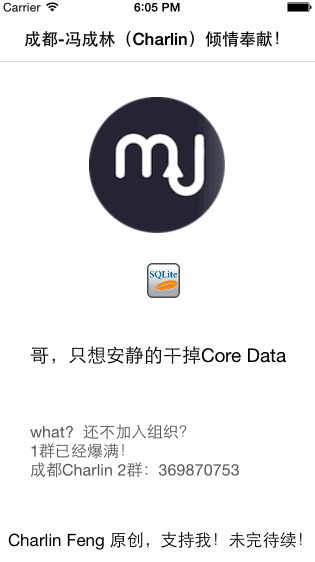

 

    Charlin出框架的目标：简单、易用、实用、高度封装、绝对解耦！

  

#### 本框架版权归成都冯成林所有！拒绝抄袭！请支持原创！

框架截图 ，你真的要先认真看看文档 CUT
===============
 

# CoreClass
    【CoreModel】MJExtension续作之三：一键ORM,全自动CURD，是时候抛弃Core Data了！！！
    

  

CoreModel系列： 请看！！！  SERIES
===============

第一季：CoreFMDB
https://github.com/nsdictionary/CoreFMDB

第二季：CoreArchive
https://github.com/nsdictionary/CoreArchive

第三季：CoreClass
https://github.com/nsdictionary/CoreClass

第四季：CoreModel模型动态缓存、列表模型动态缓存。 
暂未开源！请加群归队，获取最新信息（群信息在下面）！！！请支持第三季！

第五季：动态缓存list终结者。 
暂未开源！请加群归队，获取最新信息（群信息在下面）！！！请支持第三季！

   
本框架是隶属于MJExtension续作，我给这系列框架取了一个整体上的名字叫做：CoreModel。
CoreClass是系列第三季，共有5季，还有最后两季！连载中，请加群关注最新动态！  
成都iOS开发群： 
二群：369870753（新开，新鲜着呢，快加）  
一群：163865401（已爆满，加不上了）    

   
开源说明：（必看！！！！） YOU MUST SEE IT
===============
请支持开源，勿辜负开源精神！！！
此原创框架系列（共有5季）算是是本人几年的精华所在，现在免费开源给大家，目前承诺给大家开源到了第三季。
后续还有两季： 
>.CoreModel模型动态缓存 
>.列表模型动态缓存. 
>.动态缓存list终结者.

 
免费开源最后两季之前，我希望本框架能够得到大家足够的支持： 

-----
####请帮助本框架star数量到1000以上 

----------

没有金钱利益！但star框架，是您支持我、认可我的唯一方式，希望大家支持我！！！！！！！！谢谢！！！！！

   

Charlin Feng开源： OPEN SOURCE
===============
由于本人做过LAMP开发，之前一直是使用ThinkPHP开发，受ThinkPHP的数据库操作影响非常深远，如果你了解ThinkPHP，
你会发现本框架和ThinkPHP的数据库操作太相似了！
此框架已经存在几年了，实际年龄应该和MJExtension差不多，只是今天开源而已，
期间经历了6-8个版本的大更新，也经历了本人7个企业级项目的考验与磨砺，最终呈现在您眼前的算是一个比较成熟的版本。
   

框架说明：EXPLAIN
===============
本作是CoreModel系列第三作，是整个系列真正核心价值所在，也是真正点题MJExtension续作的地方。其复杂度与框架深度绝不比MJExtension低。
   

框架功能：FUNCTIONS
===============
本框架重点目标是实现ORM映射，并完成全自动CURD，并完成多表级联操作，从此您不再需要写一句sql！！！！数据持久化从此可以抛弃Core Data!!!!
   

特别强调：（必看！） STRESS
===============
一、凭什么口出狂言要取代Core Data? 
特别强调：本框架作为MJExtension的续作，重点在于处理网络服务器数据的本地解析与持久化，很多朋友说是否支持数据迁移？是否支持事务？锁表？ 
统一回答：本框架的核心目的再一次强调，是解决ORM映射，一键CURD以及多表级联操作。真正要实现一个数据库所有功能并不是我想要的，
我和大家一样，每次请求网络服务器数据，就想简单的安安静静的做个缓存，以便CURD而已。这也是我做这个框架的初衷。至少对于我来说，我目前几年使用Core Model后从未使用Core Data，对于我来说，算是取代了Core Data。这个问题见仁见智。 

二、为什么需要依赖很多框架？ 
如果你了解我的框架多了，你就明白。这也是我多年的经验。简单说就两个字：解耦。如果你没有洁癖或者强迫症请自行忽略此段 

三、为什么框架叫CoreClass? 
还是因为解耦与框架模块化，准备说本框架的核心叫BaseModel,而CoreClass里面含有若干BaseClass，BaseModel作为其中一个子集和
其他BaseClass是平等共存在CoreClass的。 

   

关于Swift：ABOUT SWIFT
===============
此框架已经为swift做了大量兼容，不过可惜的是runtime机制以及oc的很多特性在swift中做了变更，简单说就是MJExtension在
swift中已经无法正常使用。以下是MJ本人对swift版本的说明： 
>.MJ：不建议在Swift中使用MJExtension了哈，MJRefresh还可以用，因为Swift和OC中有些函数的用法完全不一样。我尽快推出Swift版本的MJExtension. 
>.MJ：Swift对NSClassFromString的支持跟OC不一致导致的。。。看来要写个Swift版本的MJExtension了. 

#####不过不要担心，我目前项目是swift项目，需要使用MJExtension以及CoreModel还是可以的，只要让框架活在oc的世界就行了。
   

框架依赖：DEPENDENCE
===============
.CoreStatus 
.MJExtension 
.CoreCategory 
.CoreArchive 
.CoreHttp 
.CoreFMDB 
  

正式开源 Let's Go!!!
===============
下面请跟随Charlin Feng来一起实现ORM，我会用一个过程来向大家展示这个框架的使用流程，这个流程也是我当时写框架的功能方向走势。
注：本框架有一套理论，就像Core Data需要建立模型表关联，RAC中的sinal机制一样，本框架一样有一些理论需要大家首页要明确！

### 基本理论：
1.想要完成全自动CURD,请继承BaseModel. 
2.BaseModel是MJExtension的续作，解决的是服务器数据的后续处理，并不是处理你本地自定义的一个非常数据结构复杂的模型。如含有以下成员类型的属性：NSData、UIImage、结构体、上下文等。如果实在有传结构体的，请以为字符串的形式保存。  
3.模型有一个字段必须有值:hostID,此属性是服务器数据库的id字段生成，框架已经自动将服务器的数据id对应映射为hostID。
本地sqlite有本地的id字段。  
4.根据网络数据处理原则：服务器数据和本地缓存数据对比来说，服务器数据最可靠可信，因此，你使用baseModel解析网络数据，请确保接口一定要传服务器id字段给你，且本框架只信任服务器id即模型的hostID。本地数据库的id仅仅是为了符合数据库3NF而存在。  
5.根据多年经验来说，同时参考MVVM设计模式：所有网络请求放在模型内部完成最好，BaseModel完成了所有的数据统一性：网络请求，本地数据缓存请求。关于数据统一请求性同样有一套理论，并在CoreModel第四季做详细说明。此处先行略过。  

  
### 开始实战：
开始之前，如果你发现了30个错误，请确定你导入了sqlite3的lib库文件：
 
#### 1.新建一个类User：注意请继承自BaseModel

    注：此类是一个基本类，成员属性含有各种数据类型，但不含有自定义对象  

        #import "BaseModel.h"
        #import <UIKit/UIKit.h>
        
        @interface User : BaseModel
        
        /** 用户名：字符串 */
        @property (nonatomic,copy) NSString *userName;
        
        /** 级别：整型 */
        @property (nonatomic,assign) NSUInteger level;
        
        /** 账户余额：浮点 */
        @property (nonatomic,assign) CGFloat accountMoney;
        
        
        @end

    好了，先不说这么多，我们先用一个这个模型，第一次使用模型类会自动触发很多事情，请拭目以待！
    
    请注意：我们现在还基本没有做任何事情哦？
    
    在控制器执行以下代码，并随便调用User类的任一方法：
    
        - (void)viewDidLoad {
        [super viewDidLoad];
        
        //测试用户模型
        [self userTest];
    
        }
        /** 测试用户模型 */
        -(void)userTest{
            
            //随便调用User类的任一方法，这里直接创建一个User对象
            User *user = [[User alloc] init];
        }

好了，现在请查看控制台有以下输出：

      2015-07-02 15:15:51.153 CoreClass[4727:607] dbPath:/Users/Charlin/Library/Developer/CoreSimulator/Devices/E1B1C2D8-DC98-4571-AF45-8A6D76F07497/data/Applications/1DD11CA9-E785-4C5D-88D2-3E0E1648462C/Documents/CoreClass/CoreClass.sql
        2015-07-02 15:15:51.235 CoreClass[4727:607] 表创建完毕<NSThread: 0x7b72f3e0>{name = (null), num = 1}
        2015-07-02 15:15:51.235 CoreClass[4727:607] 字段也检查完毕<NSThread: 0x7b72f3e0>{name = (null), num = 1}

我们使用navicat打开控制台输入的sql文件查看发生了什么奇迹？

            sqlite> PRAGMA table_info (User);
            +------+--------------+---------+---------+------------+------+
            | cid  | name         | type    | notnull | dflt_value | pk   |
            +------+--------------+---------+---------+------------+------+
            | 0    | id           | INTEGER | 1       | 0          | 1    |
            | 1    | userName     | TEXT    | 1       | ''         | 0    |
            | 2    | level        | INTEGER | 1       | 0          | 0    |
            | 3    | accountMoney | REAL    | 1       | 0.0        | 0    |
            | 4    | hostID       | INTEGER | 1       | 0          | 0    |
            | 5    | pModel       | TEXT    | 1       | ''         | 0    |
            | 6    | pid          | INTEGER | 1       | 0          | 0    |
            +------+--------------+---------+---------+------------+------+

已经神奇的为您创建了表，而且你输入的字段已经全部在表里面了！是不是很方便？

 
#### 2.字段自增：

下面来这个需求，当你表已经自动创建好，好开心！

产品狗突然说：“不好意思，我们要加个vip的字段！！！”

你：“。。。。。。。，什么？？？？fuck！！！。。。”

之前我在华西做一款应用叫爱哟的时候，就发生了上面这真实的一幕！！！好吧，哥受够产品狗了，我已经考虑了这个情况，先在你的模型里面添加一个字段吧，添加完后是这个样子的：

    注：请注意最后一个新加的字段：isVip
        
        #import "BaseModel.h"
        #import <UIKit/UIKit.h>
        
        @interface User : BaseModel
        
        /** 用户名 */
        @property (nonatomic,copy) NSString *userName;
        
        /** 级别 */
        @property (nonatomic,assign) NSUInteger level;
        
        /** 账户余额 */
        @property (nonatomic,assign) CGFloat accountMoney;
        
        /** 是否是vip：产品狗新加 */
        @property (nonatomic,assign) BOOL isVip;
        
        
        @end

我们就加了一个字段而已，二话不说，再运行一下项目，看看是不是有奇迹？？？？

请注意查看控制台输入：

        2015-07-02 15:35:26.348 CoreClass[4803:607] dbPath:/Users/Charlin/Library/Developer/CoreSimulator/Devices/E1B1C2D8-DC98-4571-AF45-8A6D76F07497/data/Applications/1DD11CA9-E785-4C5D-88D2-3E0E1648462C/Documents/CoreClass/CoreClass.sql
        2015-07-02 15:35:26.350 CoreClass[4803:607] 表创建完毕<NSThread: 0x7a034340>{name = (null), num = 1}
        2015-07-02 15:35:26.351 CoreClass[4803:607] 字段也检查完毕<NSThread: 0x7a034340>{name = (null), num = 1}
        2015-07-02 15:35:26.353 CoreClass[4803:607] 注意：模型 User 有新增加的字段 isVip,已经实时添加到数据库中！

再次打开navicat，或者终端查看表结构：

请注意最后一个字段：isVip：

    sqlite> PRAGMA table_info (User);
    +------+--------------+---------+---------+------------+------+
    | cid  | name         | type    | notnull | dflt_value | pk   |
    +------+--------------+---------+---------+------------+------+
    | 0    | id           | INTEGER | 1       | 0          | 1    |
    | 1    | userName     | TEXT    | 1       | ''         | 0    |
    | 2    | level        | INTEGER | 1       | 0          | 0    |
    | 3    | accountMoney | REAL    | 1       | 0.0        | 0    |
    | 4    | hostID       | INTEGER | 1       | 0          | 0    |
    | 5    | pModel       | TEXT    | 1       | ''         | 0    |
    | 6    | pid          | INTEGER | 1       | 0          | 0    |
    | 7    | isVip        | INTEGER | 1       | 0          | 0    |
    +------+--------------+---------+---------+------------+------+
    8 rows in set (0.01 sec)

是不是很轻松？你还什么都没动呢？另急，还有更强大的后面！！！！

 
#### 3.一键CURD之插入：一键CURD请全部使用类方法完成！ insert

保存模型，请注意一定要有hostID，原因请查看前面的说明！！！！非常重要。

        User *user = [[User alloc] init];
        
        //模拟服务器ID
        user.hostID = 1;
        user.userName = @"张三";
        user.level = 99;
        user.accountMoney = 1200.0f;
        user.isVip = YES;
        
        //上面是模拟数据，真实使用是MJExtension解析服务器数据
        
        //一键CURD：保存
        BOOL res = [User insert:user];
        
        if(res){
            NSLog(@"保存成功");
        }else{
            NSLog(@"保存失败");
        }
    
    
此时，控制台有以下输出：

    2015-07-02 15:43:34.822 CoreClass[4850:607] 表创建完毕<NSThread: 0x79f59e50>{name = (null), num = 1}
    2015-07-02 15:43:34.823 CoreClass[4850:607] 字段也检查完毕<NSThread: 0x79f59e50>{name = (null), num = 1}
    2015-07-02 15:43:34.823 CoreClass[4850:607] 数据插入开始<NSThread: 0x79f59e50>{name = (null), num = 1}
    2015-07-02 15:43:34.824 CoreClass[4850:607] 查询开始：<NSThread: 0x79f59e50>{name = (null), num = 1}
    2015-07-02 15:43:34.824 CoreClass[4850:607] 查询完成：<NSThread: 0x79f59e50>{name = (null), num = 1}
    2015-07-02 15:43:34.826 CoreClass[4850:607] 数据插入结束<NSThread: 0x79f59e50>{name = (null), num = 1}
    2015-07-02 15:43:34.826 CoreClass[4850:607] 插入成功

一切保存已经完成啦，看看数据库里面有没有？

        sqlite> select * from User;
        +----+----------+-------+--------------+--------+--------+-----+-------+
        | id | userName | level | accountMoney | hostID | pModel | pid | isVip |
        +----+----------+-------+--------------+--------+--------+-----+-------+
        | 1  | 张三   | 99    | 1200.0       | 1      |        | 0   | 1     |
        +----+----------+-------+--------------+--------+--------+-----+-------+
        1 rows in set (0.12 sec)

 
#### 4.一键CURD之修改：请注意修改对应数据的唯一标准是hostID，请注意你hostID的一致性！ update

 我们先修改数据内容：
 
        User *user = [[User alloc] init];
        //模拟服务器数据变更
        user.hostID = 1;
        user.userName = @"张三";
        user.level = 0;
        user.accountMoney = 10.0f;
        user.isVip = NO;
        
        //一键CURD：保存
        BOOL res = [User update:user];
        
        if(res){
            NSLog(@"修改成功");
        }else{
            NSLog(@"修改失败");
        }

查看控制台输出：

    2015-07-02 16:23:56.560 CoreClass[5486:607] 表创建完毕<NSThread: 0x7b657f80>{name = (null), num = 1}
    2015-07-02 16:23:56.561 CoreClass[5486:607] 字段也检查完毕<NSThread: 0x7b657f80>{name = (null), num = 1}
    2015-07-02 16:23:56.562 CoreClass[5486:607] 查询开始：<NSThread: 0x7b657f80>{name = (null), num = 1}
    2015-07-02 16:23:56.562 CoreClass[5486:607] 查询完成：<NSThread: 0x7b657f80>{name = (null), num = 1}
    2015-07-02 16:23:56.563 CoreClass[5486:607] 现在是更新
    2015-07-02 16:23:56.563 CoreClass[5486:607] 查询开始：<NSThread: 0x7b657f80>{name = (null), num = 1}
    2015-07-02 16:23:56.563 CoreClass[5486:607] 查询完成：<NSThread: 0x7b657f80>{name = (null), num = 1}
    2015-07-02 16:23:56.565 CoreClass[5486:607] 修改成功

数据已经修改成功，我们查看数据库：

    sqlite> select id,userName,level,accountMoney,hostID,isVip from User;
    +----+----------+-------+--------------+--------+-------+
    | id | userName | level | accountMoney | hostID | isVip |
    +----+----------+-------+--------------+--------+-------+
    | 1  | 张三   | 0     | 10.0         | 1      | 0     |
    +----+----------+-------+--------------+--------+-------+
    1 rows in set (0.00 sec)

 
#### 4.一键CURD之删除：delete

根据hostID快速删除一条记录，还是那句话，hostID是一切的核心！

        User *user = [[User alloc] init];
        
        //模拟服务器数据变更
        user.hostID = 1;
        
        //一键CURD：删除
        /**
         *  根据hostID快速删除一条记录
         *
         *  @param hostID hostID
         *
         *  @return 执行结果
         */
        BOOL res = [User delete:user.hostID];
        
        if(res){
            NSLog(@"删除成功");
        }else{
            NSLog(@"删除失败");
        }

查看控制台输出：

    2015-07-02 16:30:02.220 CoreClass[5538:607] 表创建完毕<NSThread: 0x7a9742a0>{name = (null), num = 1}
    2015-07-02 16:30:02.220 CoreClass[5538:607] 字段也检查完毕<NSThread: 0x7a9742a0>{name = (null), num = 1}
    2015-07-02 16:30:02.221 CoreClass[5538:607] 查询开始：<NSThread: 0x7a9742a0>{name = (null), num = 1}
    2015-07-02 16:30:02.221 CoreClass[5538:607] 查询完成：<NSThread: 0x7a9742a0>{name = (null), num = 1}
    2015-07-02 16:30:02.223 CoreClass[5538:607] 删除成功

再看看数据库表：

    sqlite> select id,userName,level,accountMoney,hostID,isVip from User;
    Empty set (0.00 sec)
    
可见，根据hostID已经成功删除了数据。

 
#### 5.一键CURD之保存：save
先说下为什么有这个方法，这个方法是ThinkPHP里面有的，这个方法是这样的，save一个模型，如果这个模型在数据库中不存在，就执行insert
，如果这个模型应该在数据库中存在，就执行update操作。总之，这个方法之后，这个模型一定会存在数据库中。

现在就来更新一个模型，由于我不确定本地是否有这个数据，但我一定要存，所以我就直接save

        User *user = [[User alloc] init];
        
        //模拟服务器数据变更
        user.hostID = 1;
        user.userName = @"李四";
        user.level = 30;
        user.accountMoney = 80.0f;
        user.isVip = NO;
        
        
        
        //一键CURD：保存
        BOOL res = [User save:user];
        
        if(res){
            NSLog(@"修改成功");
        }else{
            NSLog(@"修改失败");
        }
        
控制器有如下输出：

        2015-07-02 16:39:59.933 CoreClass[5639:607] 查询开始：<NSThread: 0x7b8619f0>{name = (null), num = 1}
        2015-07-02 16:39:59.934 CoreClass[5639:607] 查询完成：<NSThread: 0x7b8619f0>{name = (null), num = 1}
        2015-07-02 16:39:59.934 CoreClass[5639:607] 现在是更新
        2015-07-02 16:39:59.935 CoreClass[5639:607] 查询开始：<NSThread: 0x7b8619f0>{name = (null), num = 1}
        2015-07-02 16:39:59.935 CoreClass[5639:607] 查询完成：<NSThread: 0x7b8619f0>{name = (null), num = 1}
        2015-07-02 16:39:59.937 CoreClass[5639:607] 修改成功

查看数据库结果：

        sqlite> select id,userName,level,accountMoney,hostID,isVip from User;
        +----+----------+-------+--------------+--------+-------+
        | id | userName | level | accountMoney | hostID | isVip |
        +----+----------+-------+--------------+--------+-------+
        | 2  | 李四   | 30    | 80.0         | 1      | 0     |
        +----+----------+-------+--------------+--------+-------+
        1 rows in set (0.01 sec)

 
#### 6.一键CURD之数据批量操作：批量插入

        //一键CURD：批量插入
         BOOL res = [User inserts:@[user1,user2]];

 
#### 7.一键CURD之数据批量操作：批量保存

        //一键CURD：批量插入
        BOOL res = [User saveModels:@[user1,user2]];

 
#### 8.一键CURD之数据批量操作：模糊保存
如果你要保存模型，但不确定这是单个模型还是一个模型数组，可模糊保存

        //一键CURD：模糊保存
        BOOL res = [User saveDirect:@[user1,user2]];

   
级联操作
===============

所有操作都是全自动的，你将不会再看到一条sql。如果你不会sql，那本框架将是您的福音！

上面其实都是小菜，下面才是重点！！！！

级联操作：正如MJExtension所做的，如果一个模型有一个成员变量是另外一个模型，那是多麻烦的事情啊！放心，本框架也已经做了这个处理啦！

为了更好的演示这个情况，我们不用刚刚的User模型，重新来建立两个新的模型：Student（学生）模型、Pen（钢笔）模型且一个学生有一支钢笔。

先来看看类结构吧！

Student类：

        //  Created by 冯成林 on 15/7/2.
        //  Copyright (c) 2015年 muxi. All rights reserved.
        //
        #import <Foundation/Foundation.h>
        #import "BaseModel.h"
        #import "Pen.h"
        
        typedef enum{
            
            StudentTypeGood=0,
            
            StudentTypeBad
            
        }StudentType;
        
        
        @interface Student : BaseModel
        
        @property (nonatomic,copy) NSString *name;
        
        @property (nonatomic,assign) NSInteger childNum;
        
        @property (nonatomic,assign) float height;
        
        @property (nonatomic,assign) double earn;
        
        @property (nonatomic,assign) BOOL isMan;
        
        @property (nonatomic,assign) StudentType type;
        
        @property (nonatomic,assign) NSUInteger age;
        
        @property (nonatomic,strong) Pen *pen;
        
        @property (nonatomic,assign) int count;
        
        @property (nonatomic,assign) CGFloat money;
        
        @end

钢笔类：

        //  Created by 冯成林 on 15/7/2.
        //  Copyright (c) 2015年 muxi. All rights reserved.
        //
        
        #import "BaseModel.h"
        #import <UIKit/UIKit.h>
        
        
        
        @interface Pen : BaseModel
        
        @property (nonatomic,copy) NSString *brandName;
        
        @property (nonatomic,assign) NSUInteger usageYear;
        
        @property (nonatomic,assign) CGFloat price;
        
        @end

建立好了模型，我们先来初始化使用一下吧：

    Pen *pen = [[Pen alloc] init];
    Student *stu = [[Student alloc] init];
    stu.pen =pen;

还是和刚刚一样，什么都没做，我们直接运行一下吧，看看会怎么样？？？
运行成功，查看控制台输出：

    2015-07-02 16:56:47.141 CoreClass[5736:607] dbPath:/Users/Charlin/Library/Developer/CoreSimulator/Devices/E1B1C2D8-DC98-4571-AF45-8A6D76F07497/data/Applications/985C6FAD-E454-4581-B312-07F998EBC490/Documents/CoreClass/CoreClass.sql
    2015-07-02 16:56:47.144 CoreClass[5736:607] 表创建完毕<NSThread: 0x79726820>{name = (null), num = 1}
    2015-07-02 16:56:47.145 CoreClass[5736:607] 字段也检查完毕<NSThread: 0x79726820>{name = (null), num = 1}
    2015-07-02 16:56:47.147 CoreClass[5736:607] 表创建完毕<NSThread: 0x79726820>{name = (null), num = 1}
    2015-07-02 16:56:47.147 CoreClass[5736:607] 字段也检查完毕<NSThread: 0x79726820>{name = (null), num = 1}

好像好了？不可能吧，看看数据库里面都有什么了?

    sqlite> select name from sqlite_master where type="table";
    +-----------------+
    | name            |
    +-----------------+
    | Pen             |
    | sqlite_sequence |
    | Student         |
    +-----------------+
    3 rows in set (0.01 sec)
    
我们看到，表已经创建好了，而且是级联哦。

分别来看看各自的表结构是否正确？
    
Student表：

    sqlite> PRAGMA table_info (Student);
    +------+----------+---------+---------+------------+------+
    | cid  | name     | type    | notnull | dflt_value | pk   |
    +------+----------+---------+---------+------------+------+
    | 0    | id       | INTEGER | 1       | 0          | 1    |
    | 1    | name     | TEXT    | 1       | ''         | 0    |
    | 2    | childNum | INTEGER | 1       | 0          | 0    |
    | 3    | height   | REAL    | 1       | 0.0        | 0    |
    | 4    | earn     | REAL    | 1       | 0.0        | 0    |
    | 5    | isMan    | INTEGER | 1       | 0          | 0    |
    | 6    | type     | INTEGER | 1       | 0          | 0    |
    | 7    | age      | INTEGER | 1       | 0          | 0    |
    | 8    | count    | INTEGER | 1       | 0          | 0    |
    | 9    | money    | REAL    | 1       | 0.0        | 0    |
    | 10   | hostID   | INTEGER | 1       | 0          | 0    |
    | 11   | pModel   | TEXT    | 1       | ''         | 0    |
    | 12   | pid      | INTEGER | 1       | 0          | 0    |
    +------+----------+---------+---------+------------+------+
    13 rows in set (0.08 sec)

正确！再看看Pen表

    sqlite> 
        PRAGMA table_info (Pen);
        +------+-----------+---------+---------+------------+------+
        | cid  | name      | type    | notnull | dflt_value | pk   |
        +------+-----------+---------+---------+------------+------+
        | 0    | id        | INTEGER | 1       | 0          | 1    |
        | 1    | brandName | TEXT    | 1       | ''         | 0    |
        | 2    | usageYear | INTEGER | 1       | 0          | 0    |
        | 3    | price     | REAL    | 1       | 0.0        | 0    |
        | 4    | hostID    | INTEGER | 1       | 0          | 0    |
        | 5    | pModel    | TEXT    | 1       | ''         | 0    |
        | 6    | pid       | INTEGER | 1       | 0          | 0    |
        +------+-----------+---------+---------+------------+------+
        7 rows in set (0.01 sec)

    yes,完成正确！！！！
    
迫不及待级联插入数据看看了！！！
首页，我们来创建两个有数据对象，然后执行数据插入吧！！！切记要传hostID!!!

自定义数据如下：

开始：级联插入：

        Pen *pen = [[Pen alloc] init];
        pen.hostID=1;
        pen.price = 10;
        pen.usageYear = 3;
        pen.brandName = @"国产好铅笔";
        
        Student *stu = [[Student alloc] init];
        stu.hostID=1;
        stu.name = @"冯成林";
        stu.pen = pen;
        stu.money = 8866;
        
        //级联插入
        [Student insert:stu];
    

查看控制台输出：

        
        2015-07-02 17:09:20.554 CoreClass[5775:607] 表创建完毕<NSThread: 0x7b77e740>{name = (null), num = 1}
        2015-07-02 17:09:20.555 CoreClass[5775:607] 字段也检查完毕<NSThread: 0x7b77e740>{name = (null), num = 1}
        2015-07-02 17:09:20.556 CoreClass[5775:607] 表创建完毕<NSThread: 0x7b77e740>{name = (null), num = 1}
        2015-07-02 17:09:20.556 CoreClass[5775:607] 字段也检查完毕<NSThread: 0x7b77e740>{name = (null), num = 1}
        2015-07-02 17:09:20.557 CoreClass[5775:607] 数据插入开始<NSThread: 0x7b77e740>{name = (null), num = 1}
        2015-07-02 17:09:20.557 CoreClass[5775:607] 查询开始：<NSThread: 0x7b77e740>{name = (null), num = 1}
        2015-07-02 17:09:20.558 CoreClass[5775:607] 查询完成：<NSThread: 0x7b77e740>{name = (null), num = 1}
        2015-07-02 17:09:20.558 CoreClass[5775:607] 数据插入开始<NSThread: 0x7b77e740>{name = (null), num = 1}
        2015-07-02 17:09:20.559 CoreClass[5775:607] 查询开始：<NSThread: 0x7b77e740>{name = (null), num = 1}
        2015-07-02 17:09:20.559 CoreClass[5775:607] 查询完成：<NSThread: 0x7b77e740>{name = (null), num = 1}
        2015-07-02 17:09:21.113 CoreClass[5775:607] 数据插入结束<NSThread: 0x7b77e740>{name = (null), num = 1}
        2015-07-02 17:09:21.115 CoreClass[5775:607] 数据插入结束<NSThread: 0x7b77e740>{name = (null), num = 1}

迫不及待的打开数据库，查看Student表：

    sqlite> select * from  Student;
    +----+-----------+----------+--------+------+-------+------+-----+-------+--------+--------+--------+-----+
    | id | name      | childNum | height | earn | isMan | type | age | count | money  | hostID | pModel | pid |
    +----+-----------+----------+--------+------+-------+------+-----+-------+--------+--------+--------+-----+
    | 1  | 冯成林 | 0        | 0.0    | 0.0  | 0     | 0    | 0   | 0     | 8866.0 | 1      |        | 0   |
    +----+-----------+----------+--------+------+-------+------+-----+-------+--------+--------+--------+-----+
    1 rows in set (0.02 sec)

YES,成功！！！！ 那个Pen表对应真的自动级联了吗？看看Pen表！！！！马上！！！

    sqlite> select * from Pen;
    +----+-----------------+-----------+-------+--------+---------+-----+
    | id | brandName       | usageYear | price | hostID | pModel  | pid |
    +----+-----------------+-----------+-------+--------+---------+-----+
    | 1  | 国产好铅笔 | 3         | 10.0  | 1      | Student | 1   |
    +----+-----------------+-----------+-------+--------+---------+-----+
    1 rows in set (0.02 sec)

celebrate！！！！欢呼！！！！成功！！！！

到此，一切都安静了！！！

   

结束语： OVER
===============
到了这里，一键ORM第三季暂时告一段落了！！！但是远远还没有结束！！！
BaseModel里面还有非常多的强大特性还没有介绍！ 如果你支持我！请支持CoreClass,让更多的人看到，用到。
我和您一样期待分享CoreModel第四季！！！！！！

谢谢！再见！！

  

致谢 THANKS
===============
#####1.感谢MJ    Thanks MJ!
 
感谢杰哥！致敬MJExtension！希望大家支持杰哥的事业！  

小码哥IT教育：http://www.520it.com

    
#####2.感谢小饭   Thanks XiaoFan!

 
 感谢小饭提供的英文翻译帮助，谢谢！
    

